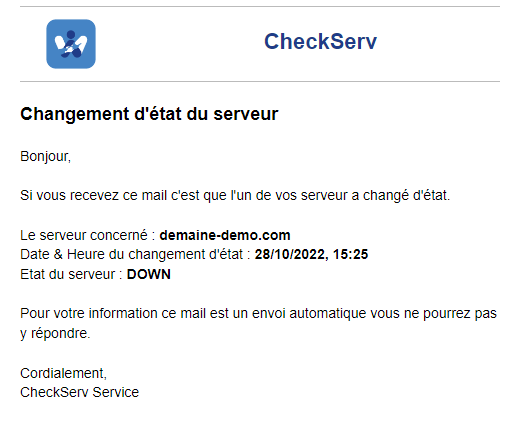

# CheckServ

> **What is "CheckServ" ?**
> **CheckServ** is a service that allows you to monitor the proper functioning of one or more servers. If one of the servers is no longer reachable, the software will automatically send an e-mail to the users with the date/time and the server concerned. CheckServ also allows you to monitor services attached to a server. If one of the services is not reachable from outside, the software will send an email.

**Example :**
> For example you want to monitor a **my-server.com** server that hosts an API using port **3000** and a VPN using port **1194**. If one of the two services is no longer reachable the mail will automatically be sent to one or more users (depending on the configuration). But if the server is not reachable, then CheckServ will send an email to inform the users but the software will not try to connect to the services associated to this server to avoid sending unnecessary emails.

**Mail :**



---

## **Supported connection**

- TCP :hostname :port

> **WARNING** CheckServ only tests **TCP** connections, services using **UDP** ports will not work with the software

## **How to setup Checkserv**

### **Windows** & **Linux** & **Mac OS**

**1/** First you need to install `node` and `npm` on your machine which will host CheckServ.

Then you will need to install a `forever` module, as follows:

```Shell
npm i -g forever
```

**2/** Clone the git directory and edit the configuration file which is under the following tree: `Checkserv/config/default.json`.

**3/** Install dependances, build the project and run it.

**Installation of dependencies**
```Shell
npm i
```
**Build project**
```Shell
npm run build
```
**Start**
```Shell
npm run start
```

You can use the following commands:
- `npm run start` - To start the service
- `npm run restart` - To restart the service. This is useful for taking into account changes to the configuration file.
- `npm run stop` - To stop the service.
- `npm run test` - Start the service and watch the console output.

If you need to know if the service is running, you can use this command: 
```Shell
forever list
```


### **DOCKER**

You can use **checkserv** with Docker. *Link : [CheckServ Docker Hub](https://hub.docker.com/r/gpatruno/checkserv)*

**1/ Configuration file**

First of all, in order for the Docker image to work properly you will need to create and edit the configuration file. This file is essential for the software. See the Editing the Config File section to edit it correctly.

In the directory of your choice create a `config` folder with the `default.yml` file inside. 

**2/ Launch the Docker image**

*On Linux & Mac OS :*
```Powershell
docker run -d -v /path/to/config:/app/config -v /path/to/logs/:/app/logs --name <container_name> gpatruno/checkserv
```
*On Windows :*
```Powershell
docker run -d -v C:\path\to\config:/app/config -v C:\path\to\logs:/app/logs --name <container_name> gpatruno/checkserv
```

*With docker-compose :*

```Yaml
version: '3.1'

services:
  checkserv:
    image: gpatruno/checkserv
    container_name: <container_name>
    restart: unless-stopped
    volumes:
      - /path/to/config:/app/config
      - /path/to/logs:/app/logs

volumes:
  checkserv:
```

## **Editing the conf file**

### **Application configuration**

Before you start editing the configuration file, you can find an example in the tree: `checkserv/config/example.yml`

To begin editing the `default.yml` file found in the `checkserv/config/default.yml` tree

<table border="1" id="bkmrk-variable-obligatoire" style="border-collapse: collapse; width: 106.914%; height: 172.07px;"><colgroup><col style="width: 16.0718%;"></col><col style="width: 15.9481%;"></col><col style="width: 51.8006%;"></col><col style="width: 16.0718%;"></col></colgroup><tbody><tr style="height: 29.8785px;"><td class="align-center" style="height: 29.8785px;"> Attributes </td><td class="align-center" style="height: 29.8785px;">Mandatory</td><td class="align-center" style="height: 29.8785px;">Description</td><td class="align-center" style="height: 29.8785px;">Value</td></tr><tr style="height: 33.6667px;"><td style="height: 33.6667px;">CLEAR_LOG</td><td class="align-center" style="height: 33.6667px;">Yes</td><td style="height: 33.6667px;">If 'true' Cleans up logs at software startup/restart</td><td style="height: 33.6667px;">true / false</td></tr><tr style="height: 29.8785px;"><td style="height: 29.8785px;">CUSTOM_CRON</td><td class="align-center" style="height: 29.8785px;">No</td><td style="height: 29.8785px;">Allows you to set your own pulse rate for testing servers/services. Waits for a value in CRON format. If the value passed is 'TEST_MAIL' at the start of the application a mail will be sent. </td><td style="height: 29.8785px;">null / '* * * * *' / 'TEST_MAIL'</td></tr><tr style="height: 29.8785px;"><td style="height: 29.8785px;">SHORT_CRON</td><td class="align-center" style="height: 29.8785px;">Yes</td><td style="height: 29.8785px;">Sending pulses every 5 mins</td><td style="height: 29.8785px;">true / false</td></tr><tr style="height: 48.7674px;"><td style="height: 48.7674px;">LONG_CRON</td><td class="align-center" style="height: 48.7674px;">Yes</td><td style="height: 48.7674px;">Sending pulses every 4 hours</td><td style="height: 48.7674px;">true / false</td></tr></tbody></table>

> If you want to make your own pulse you can use the following site to try the cron format: https://crontab.guru/

```YAML
APP:
  CLEAR_LOG: true
  CUSTOM_CRON: # Value: null / 'TEST_MAIL' / '(Format cron)' 
  SHORT_CRON: false
  LONG_CRON: false
```

### **SMTP Configuration**

```YAML
SENDER:
  EMAIL: example@mail.com       # Adresse mail
  EMAIL_PASSWORD: Password1234  # Mot de passe 
  HOST: smtp.example.com        # Serveur smtp
  PORT_EMAIL: 450               # Port smtp
```

> If you want to test your SMTP configuration, you can set the CUSTOM_CRON property to 'TEST_MAIL' as follows `CUSTOM_CRON: 'TEST_MAIL'` and don't forget to enter an email address in the configuration below.

### **User Configuration**

All users in the list will be notified as soon as a server/service changes its status. 

```YAML
user:                               # a list of users to be notified
- email: user.viewer@mail.com
- name: User 2                      # name is optional
  email: user2.viewer@mail.com
```

### **Server Configuration**

All servers in the list will have a pulse according to the CRON enabled in the APP configuration. 

<table border="1" id="bkmrk-variable-obligatoire" style="border-collapse: collapse; width: 113.086%; height: 205.643px;"><colgroup><col style="width: 15.5779%;"></col><col style="width: 84.4358%;"></col></colgroup><tbody><tr style="height: 29.8785px;"><td class="align-center" style="height: 29.8785px;">Attributes</td><td class="align-center" style="height: 29.8785px;">Description</td></tr><tr style="height: 33.6632px;"><td style="height: 33.6632px;">name</td><td style="height: 33.6632px;">Name to give to the server. The attribute must be filled in.</td></tr><tr style="height: 33.6632px;"><td style="height: 33.6632px;">host</td><td style="height: 33.6632px;">The domain name or IP address of the server to be monitored. The attribute must be filled in. </td></tr><tr style="height: 33.6632px;"><td style="height: 33.6632px;">port</td><td style="height: 33.6632px;">The number of the port to use for the connection. By default the port used is 22. The attribute is not required to be filled in.</td></tr><tr style="height: 33.6632px;"><td style="height: 33.6632px;">defaultState</td><td style="height: 33.6632px;">The default state of the server. Expected value: true/false. If set to 'false' the software will not attempt to connect to the server or server services. Default is 'true'. The attribute does not have to be filled in.</td></tr><td style="height: 33.6632px;">services</td><td style="height: 33.6632px;">A list of services to monitor that are hosted on the same server. The attribute does not have to be filled in. See **Configuration of services** for how to configure them.</td></tr></tbody></table>

```YAML
servers:                            # A server list
- name: Server Demo                 # Server name
  host: demo.domaine-name.com       # Host: domaine name or ip address
  port: 22                          # optional, default value port: 22
  defaultstate: false               # optional, default value defaultstate: true
  services:                         # optional, default value services: null
```

### **Configuration of services**

The services are necessarily attached to a server. Because the software will use the same value of the **host** attribute of the server, only the addressing of the **port** will change. 

<table border="1" id="bkmrk-variable-obligatoire" style="border-collapse: collapse; width: 113.086%; height: 205.643px;"><colgroup><col style="width: 15.5779%;"></col><col style="width: 84.4358%;"></col></colgroup><tbody><tr style="height: 29.8785px;"><td class="align-center" style="height: 29.8785px;">Attributes</td><td class="align-center" style="height: 29.8785px;">Description</td></tr><tr style="height: 33.6632px;"><td style="height: 33.6632px;">name</td><td style="height: 33.6632px;">Name to give to the service. The attribute must be filled in.</td></tr><tr style="height: 33.6632px;"><td style="height: 33.6632px;">port</td><td style="height: 33.6632px;">The number of the port to use for the connection. The attribute must be filled in.</td></tr><tr style="height: 33.6632px;"><td style="height: 33.6632px;">defaultState</td><td style="height: 33.6632px;">The default state of the service. Expected value: true/false. If set to 'false' the software will not attempt to connect to the service. Default is 'true'. The attribute does not have to be filled in.</td></tbody></table>

```YAML
servers:                            
- name: Server Demo                 
  host: domaine-demo.com       
  services:
  - name: OpenVPN
    port: 1194
    defaultstate: false     # optional, default value defaultstate: true
  - name: API 
    port: 3000
```

## **Logs**

When the service is started for the first time the `logs` folder will be created. Inside it are 2 files: 

- default.log - All logs (mail sent, pulses, server and service status)
- error.log - errors

If you are using CheckServ with `forever`, two other files will be created in the root of the project: 

- ```checkservout.log``` -  Output forever 
- ```checkserverror.log``` - Error forever

## **Testing the connection**

It is possible to test your servers/services without using the software but with tools such as telnet, Test-NetConnection.

### **On Windows**

With Powershell thanks to the tool `Test-NetConnection` : 

```Powershell
Test-NetConnection -ComputerName <host> -port <port>
```
If successful :

```Powershell
Test-NetConnection -ComputerName domaine-demo.com -port 5432


ComputerName            : domaine-demo.com
RemoteAddress           : 150.123.123.123
RemotePort              : 5432
InterfaceAlias          : Wi-Fi
SourceAddress           : 192.123.123.123
TcpTestSucceeded        : True
```
If unsuccessful :

```Powershell
Test-NetConnection -ComputerName domaine-demo.com -port 3000


ComputerName            : domaine-demo.com
RemoteAddress           : 150.123.123.123
RemotePort              : 3000
InterfaceAlias          : Wi-Fi
SourceAddress           : 192.123.123.123
PingSucceeded           : True
PingReplyDetails (RTT)  : 32 ms
TcpTestSucceeded        : False
```

### **On Linux**

With Bash thanks to the tool `telnet` : 

```Bash
telnet <host> <port>
```

If successful :

```Bash
telnet domaine-demo.com 5432
Trying 150.123.123.123...
Connected to domaine-demo.com.
Escape character is '^]'.
```
> Use `Ctrl + C` or `Ctrl + ] + q` to quit

If unsuccessful :

```Bash
telnet domaine-demo.com 3000
Trying 150.123.123.123...
telnet: Unable to connect to remote host: Connection timed out
```

## **Module used**

- Mail - `nodemailer` // Send Mail
- TCP - `tcp-port-used`     // Connect to a server/service
- Config - `config` // Use config file
- Cron - `node-cron` // To schedule task
- Logger - `winston` // To output Logs
